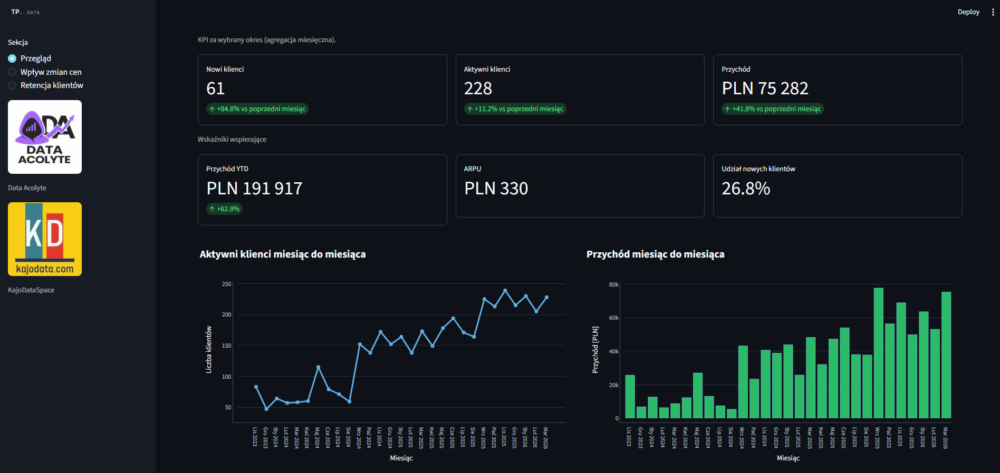
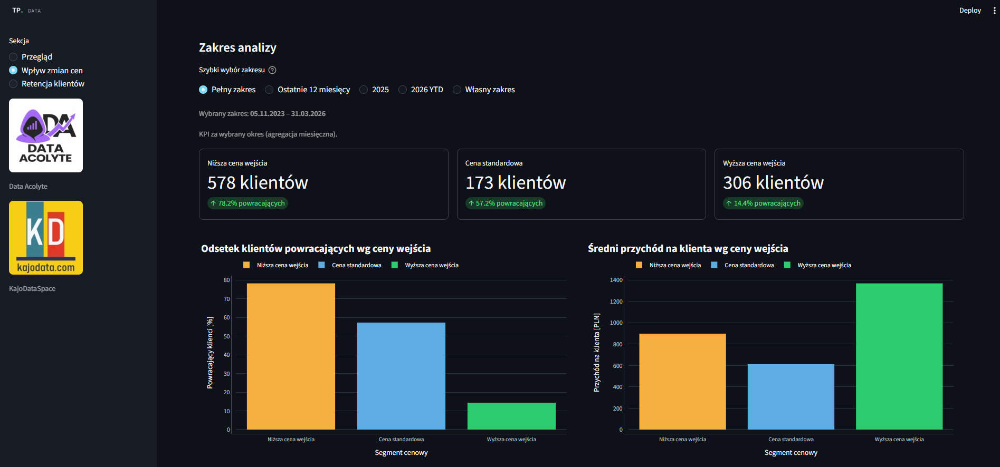
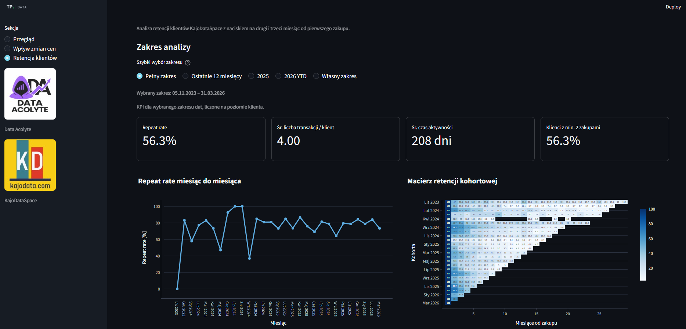

# KajoDataSpace Dashboard

Dashboard analityczny zbudowany w Streamlit do analizy transakcji KajoDataSpace. Projekt prezentuje kluczowe wskaźniki sprzedażowe, zachowania klientów, retencję oraz hipotezy dotyczące wpływu zmian cen na wyniki biznesowe.

## Najważniejsze funkcje

- przegląd KPI sprzedażowych i trendów miesięcznych,
- analiza aktywnych i nowych klientów,
- analiza retencji klientów i repeat rate,
- interaktywne wykresy wspierające interpretację biznesową.

## Screenshots

### Przegląd


### Wpływ zmian cen


### Retencja klientów


## Uruchomienie lokalne

```bash
pip install -r requirements.txt
streamlit run app.py
```

## Technologie

- Python
- Streamlit
- Pandas
- Plotly

## Struktura projektu

```text
kajodata-dashboard/
├── images/
│   ├── overview.png
│   ├── clients.png
│   ├── pricing.png
│   ├── revenue_chart.png
│   ├── active_clients_chart.png
│   └── transaction_hour_chart.png
├── .idea/
├── .streamlit/
├── .venv/
├── __pycache__/
├── data/
├── views/
├── app.py
├── charts.py
├── components.py
├── config.py
├── data_loader.py
├── formatters.py
├── metrics.py
├── README.md
└── transforms.py
```

## Opis plików i folderów

- `.idea/` – pliki konfiguracyjne środowiska IDE.
- `.streamlit/` – konfiguracja aplikacji Streamlit, np. motyw i ustawienia.
- `.venv/` – lokalne środowisko wirtualne Pythona.
- `__pycache__/` – cache Pythona z plikami pośrednimi.
- `data/` – dane wejściowe do analizy.
- `views/` – osobne widoki / podstrony dashboardu.
- `app.py` – główny punkt wejścia aplikacji Streamlit.
- `charts.py` – funkcje odpowiedzialne za budowę wykresów.
- `components.py` – współdzielone komponenty interfejsu użytkownika.
- `config.py` – ustawienia i stałe konfiguracyjne projektu.
- `data_loader.py` – ładowanie i wstępne przygotowanie danych.
- `formatters.py` – funkcje do formatowania wartości, dat i etykiet.
- `metrics.py` – logika obliczania KPI i metryk biznesowych.
- `README.md` – dokumentacja projektu.
- `transforms.py` – transformacje danych używane w analizie i widokach.

## Architektura

Projekt jest podzielony na warstwy:

- **dane** – `data_loader.py`, `transforms.py`,
- **logika analityczna** – `metrics.py`,
- **prezentacja** – `charts.py`, `components.py`, `views/`,
- **konfiguracja** – `config.py`.

Taki układ ułatwia rozwijanie dashboardu i utrzymanie kodu w miarę dodawania kolejnych sekcji.

## Możliwe rozwinięcia

- deployment aplikacji na Streamlit Community Cloud,
- rozbudowa sekcji retencji i analiz klientowskich,
- eksport wybranych insightów i wykresów,
- dalsze rozwijanie warstwy rekomendacji biznesowych.